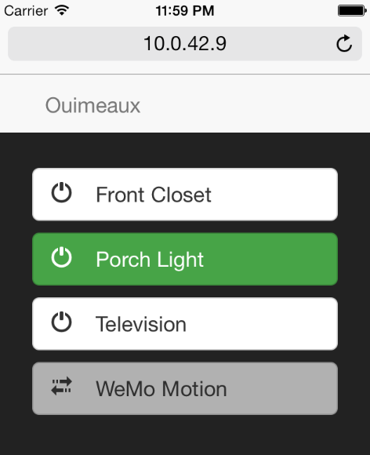

=======
Server
=======

``wemo server`` starts a process serving up both a Web app providing basic
device control and a REST API allowing integration with any number of services.

The necessary dependencies to run the server are not installed unless the
``server`` feature is specified at installation::

    $ pip install ouimeaux[server]

Configuration
-------------
The IP and port to which the server will bind are specified by the ``listen``
parameter in the configuration file. Default: ``0.0.0.0:5000``.  
Optionally, basic authentication can be enabled for the web server by 
setting the ``auth`` parameter in the configuration file.

Web App
--------
The Web app very simply presents buttons allowing control of devices and
indicating current state. Motions appear as disabled buttons but will turn
green when activated.

REST API
---------
A vaguely RESTful API is provided to control devices. Arguments, where
specified, may be passed either as query arguments or as JSON::
    
    curl -X POST http://localhost:5000/api/environment -d '{"seconds":10}'

is as valid as::

    curl -X POST http://localhost:5000/api/environment?seconds=10

.. table::

   =====================         =========================================
   Resource                      Description
   =====================         =========================================
   GET /api/environment          Returns a JSON description of all devices 
                                 in the environment
   POST /api/environment         Initiates a discovery of the environment.
                                 Optional ``seconds`` argument (default: 5)
                                 determines length of discovery.
   GET /api/device/NAME          Returns a JSON description of the device 
                                 named NAME. NAME will be fuzzy-matched 
                                 against device names, as on the command
                                 line (e.g., "closet" will match "Hall 
                                 Closet"). 
   POST /api/device/NAME         Toggle switch state, specified by optional
                                 ``state`` argument (default: "toggle"). Valid
                                 values are "on", "off" or "toggle".
   =====================         =========================================
